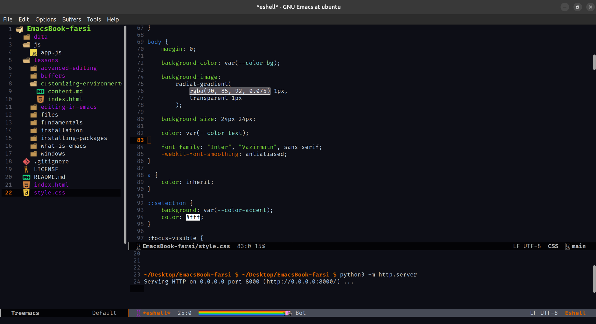

# شخصی سازی محیط

تا اینجا با مفاهیم اولیه‌ی Emacs آشنا شدیم و یاد گرفتیم چطور پکیج نصب کنیم. اما یکی از مهم‌ترین ویژگی‌های Emacs اینه که تقریباً تمام بخش‌های اون قابل تغییر و شخصی‌سازی هست.

در Emacs تقریباً هر چیزی می‌تونه تغییر کنه؛ از ظاهر و فونت گرفته تا کلیدهای میانبر، رفتار Bufferها، نحوه‌ی نمایش اطلاعات و حتی اضافه کردن قابلیت‌های جدید.

مرکز اصلی تنظیمات شخصی Emacs فایلی به اسم `init.el` هست.

این فایل در واقع یک فایل **Emacs Lisp** هست که Emacs هنگام اجرا اون رو می‌خونه و دستورهای داخلش رو اجرا می‌کنه.

در فصل قبل برای اضافه کردن MELPA و فعال کردن `nyan-mode` با `init.el` کار کردیم. در این فصل می‌خوایم با ساختار این فایل بیشتر آشنا بشیم و چند تنظیم کاربردی به اون اضافه کنیم.

## فایل init.el

مسیر معمول فایل تنظیمات Emacs در سیستم‌های GNU/Linux:

```text
~/.emacs.d/init.el
```

برای باز کردن این فایل از داخل Emacs:

```text
C-x C-f ~/.emacs.d/init.el
```

اگر فایل وجود نداشته باشه، Emacs هنگام ذخیره کردن اون رو ایجاد می‌کنه.

هر دستوری که داخل این فایل قرار بدی، هنگام اجرای Emacs اجرا خواهد شد.

برای مثال:

```elisp
(message "Hello from init.el!")
```

بعد از اجرای Emacs، این پیام در Echo Area نمایش داده می‌شه.

## اجرای دوباره‌ی تنظیمات بدون Restart

هنگام تغییر دادن `init.el` لازم نیست همیشه Emacs رو ببندی و دوباره باز کنی.

برای اجرای کل فایل:

```text
M-x eval-buffer
```

برای اجرای فقط یک بخش انتخاب‌شده:

```text
M-x eval-region
```

و اگر فقط می‌خوای آخرین عبارت Lisp قبل از مکان‌نما اجرا بشه:

```text
C-x C-e
```

این قابلیت باعث می‌شه هنگام تنظیم کردن Emacs خیلی سریع تغییرات رو امتحان کنی.

## حذف بخش‌های اضافی رابط کاربری

Emacs به‌صورت پیش‌فرض چند بخش گرافیکی مثل Menu Bar، Tool Bar و Scroll Bar رو نمایش می‌ده.

اگر ترجیح می‌دی محیط ساده‌تر و شبیه یک ویرایشگر متنی داشته باشی، می‌تونی این کد هارو به init.el اضافه کنی.

### حذف Tool Bar

```elisp
(tool-bar-mode -1)
```

### حذف Menu Bar

```elisp
(menu-bar-mode -1)
```

### حذف Scroll Bar

```elisp
(scroll-bar-mode -1)
```

ترکیب این سه تنظیم:

```elisp
(tool-bar-mode -1)
(menu-bar-mode -1)
(scroll-bar-mode -1)
```

یک محیط خلوت‌تر ایجاد می‌کنه.

برای فعال کردن دوباره‌ی هرکدام، مقدار `-1` رو به `1` تغییر بده.

مثلاً:

```elisp
(tool-bar-mode 1)
```

## نمایش شماره‌ی خطوط

یکی از قابلیت‌های مهم هنگام برنامه‌نویسی، دیدن شماره‌ی خطوط فایل است.

برای فعال کردن شماره‌ی خطوط در تمام Bufferها:

```elisp
(global-display-line-numbers-mode 1)
```

برای خاموش کردن:

```elisp
(global-display-line-numbers-mode -1)
```

همچنین می‌تونی فقط برای Buffer فعلی فعالش کنی:

```text
M-x display-line-numbers-mode
```

## نمایش شماره‌ی ستون

Emacs به‌صورت پیش‌فرض شماره‌ی ستون مکان‌نما را نمایش نمی‌دهد.

برای فعال کردن این قابلیت:

```elisp
(column-number-mode 1)
```

بعد از فعال شدن، اطلاعاتی مثل شماره‌ی خط و ستون در Mode Line نمایش داده می‌شود.

## تنظیم فونت

یکی از اولین تغییراتی که بسیاری از کاربران انجام می‌دهند، انتخاب فونت مناسب است.

برای تغییر فونت پیش‌فرض:

```elisp
(set-face-attribute 'default nil
                    :family "firacode"
                    :height 120)
```

در این مثال:

* `firacode` نام فونت است.
* مقدار `120` اندازه‌ی فونت را مشخص می‌کند.

برای تغییر فقط اندازه:

```elisp
(set-face-attribute 'default nil :height 140)
```

برای دیدن فونت‌های موجود:

```text
M-x list-fonts-display
```

## تغییر اندازه‌ی فونت هنگام کار

بدون تغییر `init.el` هم می‌توانی اندازه‌ی فونت را تغییر بدهی.

بزرگ‌تر کردن فونت:

```text
C-x C-+
```

کوچک‌تر کردن فونت:

```text
C-x C--
```

بازگشت به اندازه‌ی پیش‌فرض:

```text
C-x C-0
```

## تغییر Theme

Emacs چند Theme داخلی دارد.

برای انتخاب Theme:

```text
M-x load-theme
```

برای مثال:

```elisp
(load-theme 'wombat t)
```

پارامتر `t` باعث می‌شود Emacs بدون پرسیدن تأیید، Theme را فعال کند.

برای دیدن Themeهای موجود می‌توانی از:

```text
M-x load-theme
```

استفاده کنی.

## ذخیره‌ی موقعیت فایل‌ها

گاهی اوقات هنگام باز کردن دوباره‌ی یک فایل، دوست داری Emacs مکان قبلی مکان‌نما را به یاد داشته باشد.

برای فعال کردن این قابلیت:

```elisp
(save-place-mode 1)
```

بعد از این تنظیم، Emacs موقعیت آخرین مکان‌نما را برای فایل‌ها ذخیره می‌کند.

## فایل‌های اخیر

Emacs می‌تواند لیستی از فایل‌هایی که اخیراً باز کرده‌ای نگه دارد.

برای فعال کردن:

```elisp
(recentf-mode 1)
```

برای دیدن فایل‌های اخیر:

```text
M-x recentf-open-files
```

## ساخت کلید میانبر

یکی از بخش‌های مهم شخصی‌سازی Emacs، ساخت Key Bindingهای شخصی است.

برای مثال:

```elisp
(global-set-key (kbd "C-c n") #'display-line-numbers-mode)
```

حالا با:

```text
C-c n
```

شماره‌ی خطوط فعال یا غیرفعال می‌شود.

ساختار کلی:

```elisp
(global-set-key (kbd "KEY") #'COMMAND)
```

مثلاً:

```elisp
(global-set-key (kbd "C-c r") #'recentf-open-files)
```

حالا:

```text
C-c r
```

لیست فایل‌های اخیر را باز می‌کند.

## فعال کردن پکیج‌ها هنگام شروع Emacs

پکیج‌هایی که نصب می‌کنی معمولاً باید هنگام اجرای Emacs فعال شوند.

مثلاً برای `nyan-mode`:

```elisp
(require 'nyan-mode)
(nyan-mode 1)
```

بعد از اضافه کردن این کد، هر بار که Emacs باز شود، `nyan-mode` فعال خواهد شد.

## نمایش درخت فایل‌ها با Treemacs

تا اینجا محیط رو خلوت‌تر و خواناتر کردیم، ولی هنوز راه ساده‌ای برای دیدن ساختار پوشه‌ها و فایل‌های یک پروژه نداریم.

پکیج `treemacs` یک پنل کناری شبیه File Explorer به Emacs اضافه می‌کند و یکی از پرکاربردترین پکیج‌ها برای کسانی است که با پروژه‌های چند فایلی کار می‌کنند.

نصب آن مثل هر پکیج دیگری از MELPA است:

```text
M-x package-install RET treemacs RET
```

برای باز و بسته کردن پنل Treemacs:

```text
M-x treemacs
```

با اجرای دوباره‌ی همین دستور، پنل بسته می‌شود.

داخل پنل Treemacs می‌توان با کلیدهای معمول حرکت کرد و با زدن Enter روی یک فایل، آن را باز کرد.

برای راحتی بیشتر، بهتر است یک Key Binding برای باز و بسته کردن سریع آن تعریف کنیم:

```elisp
(require 'treemacs)
(global-set-key (kbd "C-c t") #'treemacs)
```

حالا با:

```text
C-c t
```

پنل Treemacs باز یا بسته می‌شود.

## یک Mode Line بهتر با Doom Modeline

پیش‌تر با `column-number-mode` شماره‌ی خط و ستون را به Mode Line اضافه کردیم، اما ظاهر پیش‌فرض Mode Line در Emacs ساده و کم‌اطلاعات است.

پکیج `doom-modeline` یک Mode Line شیک‌تر و پرجزئیات‌تر ارائه می‌دهد که اطلاعاتی مثل نام حالت فعلی، وضعیت Git، و نوع فایل را واضح‌تر نشان می‌دهد.

با اینکه اسم این پکیج از Doom Emacs (یک Distribution کامل و پیکربندی‌شده‌ی Emacs) گرفته شده، خودِ پکیج کاملاً مستقل است و روی هر Emacs معمولی هم قابل نصب و استفاده‌ست؛ نیازی به نصب یا یادگیری Doom Emacs نیست.

نصب پکیج:

```text
M-x package-install RET doom-modeline RET
```

فعال کردن آن در `init.el`:

```elisp
(require 'doom-modeline)
(doom-modeline-mode 1)
```

بعد از فعال شدن، ظاهر نوار پایین Emacs بلافاصله تغییر می‌کند و خواناتر می‌شود.

## یک init.el ساده

حالا تنظیمات قبلی را کنار هم قرار می‌دهیم:

```elisp
;; Appearance
(tool-bar-mode -1)
(menu-bar-mode -1)
(scroll-bar-mode -1)

;; Display
(global-display-line-numbers-mode 1)
(column-number-mode 1)
(require 'doom-modeline)
(doom-modeline-mode 1)

;; Theme
(load-theme 'wombat t)

;; Files
(save-place-mode 1)
(recentf-mode 1)

;; Project navigation
(require 'treemacs)
(global-set-key (kbd "C-c t") #'treemacs)

;; Font
(set-face-attribute 'default nil
                    :family "firacode"
                    :height 110)
```

این یک نقطه‌ی شروع ساده برای شخصی‌سازی Emacs است.

## مرتب نگه داشتن init.el

با بزرگ‌تر شدن فایل تنظیمات، مرتب نگه داشتن آن اهمیت بیشتری پیدا می‌کند.

یک روش ساده این است که بخش‌های مختلف را جدا کنیم:

```elisp
;; Appearance

(tool-bar-mode -1)
(menu-bar-mode -1)
(scroll-bar-mode -1)


;; Display

(global-display-line-numbers-mode 1)
(column-number-mode 1)


;; Theme

(load-theme 'wombat t)


;; Files

(save-place-mode 1)
(recentf-mode 1)
```

در Emacs Lisp هر چیزی که بعد از `;;` نوشته شود، Comment محسوب می‌شود.


## مدیریت خطاهای init.el

چون `init.el` هنگام شروع Emacs اجرا می‌شود، یک خطای کوچک در آن می‌تواند باعث شود بخشی از تنظیمات اجرا نشوند.

اگر بعد از اضافه کردن یک تنظیم جدید مشکلی ایجاد شد:

* آخرین تغییرات را بررسی کن.
* دستورهای جدید را جداگانه اجرا کن.
* پیام‌های خطا را بخوان.

برای دیدن پیام‌های قبلی:

```text
M-x view-echo-area-messages
```


## جمع‌بندی

در این فصل یاد گرفتیم:

* `init.el` مرکز اصلی تنظیمات شخصی Emacs است.
* تنظیمات Emacs با زبان Emacs Lisp نوشته می‌شوند.
* می‌توانیم بدون Restart با `eval-buffer` و `eval-region` تغییرات را اعمال کنیم.
* می‌توانیم ظاهر Emacs را تغییر دهیم.
* می‌توانیم Tool Bar، Menu Bar و Scroll Bar را حذف کنیم.
* می‌توانیم شماره‌ی خطوط و ستون را فعال کنیم.
* می‌توانیم فونت و Theme را تغییر دهیم.
* می‌توانیم فایل‌های اخیر و موقعیت فایل‌ها را ذخیره کنیم.
* می‌توانیم Key Bindingهای اختصاصی بسازیم.
* می‌توانیم پکیج‌ها را هنگام شروع Emacs فعال کنیم.
* با `treemacs` می‌توانیم درخت فایل‌های یک پروژه را در یک پنل کناری ببینیم.
* با `doom-modeline` می‌توانیم ظاهر Mode Line را شیک‌تر و پرجزئیات‌تر کنیم.
* یاد گرفتیم `init.el` را مرتب و قابل نگهداری بنویسیم.

در فصل‌های بعدی سراغ قابلیت‌های پیشرفته‌تر Emacs می‌رویم و یاد می‌گیریم چطور این ویرایشگر را به یک محیط کامل برنامه‌نویسی تبدیل کنیم.
o