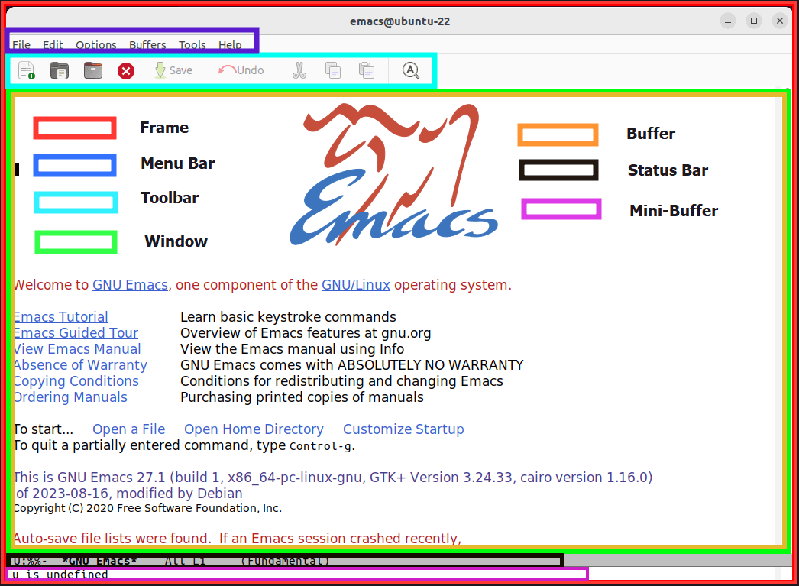

# آشنایی با مفاهیم اولیه

قبل از اینکه وارد commandها و workflowهای جدی Emacs بشیم،
بهتره با چند مفهوم پایه آشنا بشیم. این مفاهیم تقریباً
همه‌جا در Emacs با ما همراه خواهند بود.

## اول از همه: Emacs چطور کار می‌کند؟

در نگاه اول، Emacs شبیه خیلی از ویرایشگرهای متن دیگر است:
برنامه را باز می‌کنی، یک فایل را باز می‌کنی، متن می‌نویسی
و فایل را ذخیره می‌کنی.

اما Emacs مدل ذهنی متفاوتی دارد. به جای اینکه همه‌چیز را
فقط حول «فایل» ببینیم، چند مفهوم دیگر هم داریم که باید
بشناسیم.

## Buffer

**Buffer** فضایی است که Emacs برای کار کردن
با متن یا اطلاعات دیگر در اختیارمان می‌گذارد.

وقتی یک فایل را باز می‌کنی، Emacs معمولاً محتوای آن فایل
را داخل یک Buffer قرار می‌دهد و تو در واقع با همان Buffer
کار می‌کنی.

نکته‌ی مهم این است که هر Buffer الزاماً یک فایل نیست.
Emacs می‌تواند Bufferهایی داشته باشد که به هیچ فایل خاصی
روی دیسک مربوط نیستند.

## Frame

چیزی که معمولاً به عنوان «پنجره‌ی اصلی Emacs» می‌بینی،
در اصطلاح Emacs یک **Frame** است.

یک Frame می‌تواند چند بخش مختلف داشته باشد و Bufferهای
مختلف را در خودش نمایش دهد.

## Window

اینجا اسم‌گذاری Emacs کمی ممکن است گیج‌کننده باشد.

چیزی که در خیلی از برنامه‌ها به آن window می‌گوییم،
در Emacs معمولاً **Frame** است.
در عوض، بخش‌های داخل یک Frame که Bufferها را نمایش
می‌دهند، **Window** نام دارند.

بنابراین یک Frame می‌تواند به چند Window تقسیم شود و
هر Window می‌تواند یک Buffer متفاوت را نمایش دهد.

## Point

محل فعلی ویرایش در Emacs را **Point**
می‌نامیم.

وقتی با keyboard در متن حرکت می‌کنی، Point جابه‌جا می‌شود
و عملیات ویرایشی معمولاً نسبت به موقعیت Point انجام
می‌شوند.

## Mode

Emacs برای انواع مختلف کارها، رفتارها و امکانات متفاوتی
دارد. این رفتارها تا حد زیادی توسط **Mode**ها
مشخص می‌شوند.

مثلاً وقتی یک فایل Python را باز می‌کنی، Emacs می‌تواند
از یک Mode مخصوص Python استفاده کند تا امکانات مرتبط با
آن زبان را در اختیارت قرار دهد.

در ادامه بیشتر با Modeها آشنا می‌شویم.

## Command

در Emacs تقریباً هر کاری را می‌توان به یک
**Command** نسبت داد.

Command در واقع عملی است که Emacs می‌تواند اجرا کند؛
مثلاً باز کردن فایل، ذخیره کردن، جستجو یا جابه‌جایی
در متن.

یکی از چیزهایی که در ادامه یاد می‌گیریم این است که چطور
این Commandها را اجرا کنیم و برای کارهای مختلف از
keyboard استفاده کنیم.

## Minibuffer

پایین محیط Emacs ناحیه‌ای وجود دارد که به آن
**Minibuffer** می‌گویند.

Emacs از Minibuffer برای گرفتن ورودی از کاربر و نمایش
اطلاعات مختلف استفاده می‌کند.

خیلی از Commandهایی که بعداً استفاده خواهیم کرد،
از Minibuffer برای گرفتن اطلاعات بیشتر استفاده می‌کنند.

## یک تصویر ذهنی

اگر بخواهیم همه‌ی این مفاهیم را کنار هم بگذاریم، می‌توانیم
فعلاً چنین تصویری در ذهن داشته باشیم:

یک **Frame** داریم که داخل آن چند
**Window** قرار گرفته‌اند. هر Window یک
**Buffer** را نمایش می‌دهد و
**Point** موقعیت فعلی ما در Buffer را مشخص
می‌کند.

نوع کاری که با Buffer انجام می‌دهیم می‌تواند تحت تأثیر
**Mode** باشد و برای انجام کارها از
**Command**ها استفاده می‌کنیم.

